1. toc
{:toc}

# はじめに

このドキュメントは NanoVNA に関する非公式なユーザーガイドです。

[github レポジトリ](https://github.com/cho45/NanoVNA-manual) で管理しています。最新ファームウェアと齟齬がある場合など、修正内容がある場合は Pull-request を送ってください。

## NanoVNA とは

NanoVNA のハードウェアにはいくつか種類があり、このドキュメントが対象とするのは以下のハードウェアです。

- ttrftech 版 (オリジナル) [ttrftech/NanoVNA](https://github.com/ttrftech/NanoVNA)
- hugen79 版 [hugen79/NanoVNA-H](https://github.com/hugen79/NanoVNA-H)

これらのハードウェアは回路上のコンポーネントがほぼ同じであり、共通のファームウェアが利用できます。

## 動作に必要なもの

最低限以下のものが必要です。

 * NanoVNA 本体
 * SMA LOAD 50Ω
 * SMA SHORT
 * SMA OPEN
 * SMA Female to Female スルーコネクタ
 * SMA Male to Male ケーブル × 2


## NanoVNA の基礎

VNA (Vector Network Analyzer) は高周波網 (RF Network) の反射電力および通過電力の周波数特性を計測するものです。

NanoVNA は以下の要素を測定します。

 * 入力電圧の IQ 信号
 * 反射電圧の IQ 信号
 * 通過電圧の IQ 信号

ここから以下を算出します。

 * 反射係数 (reflection coefficients) S11
 * 伝送係数 (transmission coefficient) S21

これらから算出可能な以下の項目を表示できます。

 * 反射損失
 * 通過損失
 * 複素インピーダンス
   * レジスタンス
   * リアクタンス
 * SWR

など。

## NanoVNA の発振周波数

NanoVNA では測定対象の周波数帯域の 101 点を対象に、反射係数・伝送係数を測定します。

NanoVNA の局発周波数は 50kHz から 300MHz です。これ以上の周波数は高調波モードを使用します。高調波モードでも基本波は減衰されません。
周波数ごとの利用モードは以下の通りです。

* 300MHz まで: 基本波
* 300MHz から 900MHz まで: 第 3 次高調波
* 900MHz から 1500MHz まで: 第 5 次高調波

特にアンプの利得などを確認する場合、常に基本波の入力もあることに注意が必要です。

入力は、いずれの場合も 5kHz の中間周波数に変換されます。信号は 48kHz サンプリングでアナログ・デジタル変換されます。デジタルデータは MCU にて信号処理されます。

# 最初にすること

使用するためには最初に必ず較正を行う必要があります。最初は以下の通りに較正を行います。

 * START が 50kHz であることを確認する
 * STOP が 900MHz であることを確認する
 * <a href="#%E8%BC%83%E6%AD%A3%E6%96%B9%E6%B3%95">較正方法</a>に従って較正を行う

# 入力方法

NanoVNA には以下の入力があります。

 * タッチパネルのタップ・ロングタップ
 * レバースイッチ
   * L / L 長押し
   * R / R 長押し
   * 押し込み / 押し込み長押し
 * 電源スライドスイッチ

# 画面の見方

## メイン画面

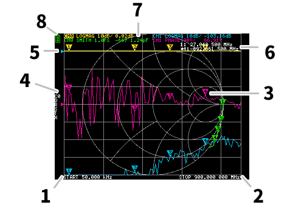

### 1. START 2. STOP 周波数
スタート・ストップを指定したときのそれぞれの周波数が表示されます。

### 3. マーカー
トレースそれぞれのマーカーの位置が表示されます。選択されたマーカーは以下の方法で移動できます。

 * タッチパネルでマーカーをドラッグ
 * レバースイッチの L R 長押し

### 4. 較正状態

読みこんでいる較正のデータ番号及び、適用されている誤差補正について表示されます。

 * `C0` `C1` `C2` `C3` `C4` それぞれ、対応する番号の較正データがロードされていることを示します。
 * `c0` `c1` `c2` `c3` `c4` それぞれ、対応する番号の較正データがロードされていることを示していますが、ロード後に周波数範囲が変更されており誤差補正に補完を使っていることを示します。
 * `D` directivity 誤差補正が適用されていることを示します
 * `R` refrection tracking 誤差補正が適用されていることを示します
 * `S` source match 誤差補正が適用されていることを示します
 * `T` transmission tracking 誤差補正が適用されていることを示します
 * `X` isolation (crosstalk) 誤差補正が適用されていることを示します

### 5. リファレンスポジション

対応するトレースのリファレンスポジションを示します。`DISPLAY` `SCALE` `REFERENCE POSITION` で位置を変更できます。

### 6. マーカー状態

選択中のアクティブなマーカーと、以前にアクティブだったマーカーが 1 つ表示されます。

### 7. トレース状態

各トレースフォーマットの状態と、アクティブなマーカーに対応する値が表示されます。

例えば `CH0 LOGMAG 10dB/ 0.02dB` という表示の場合は以下のように読みます。

 * チャンネル CH0 (リフレクション)
 * フォーマット `LOGMAG`
 * スケールは 10dB
 * 現在の値が 0.02dB

またアクティブなトレースはチャンネルの表示が反転します。

### 8. バッテリー状態

バッテリーが装着され、PCB 上の `D2` が実装済みの場合バッテリー電圧に応じてアイコンが表示されます。

---

## メイン画面2

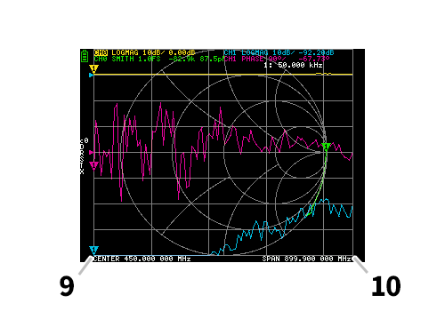

### 9. CENTER 周波数 10. スパン

センター周波数とスパンを指定したときのそれぞれの周波数が表示されます。

---

### メニュー画面

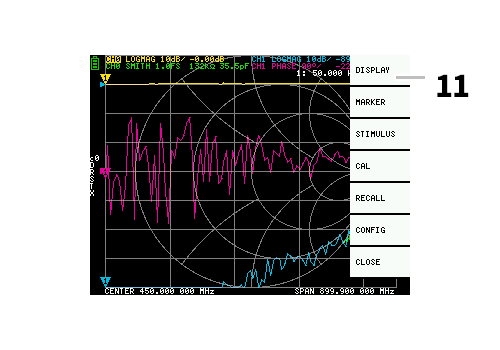

### 11. メニュー

以下の操作でメニューを表示できます。

 * タッチパネルのマーカー以外の場所をタップした場合
 * レバースイッチ押し込み

---

## キーパッド画面

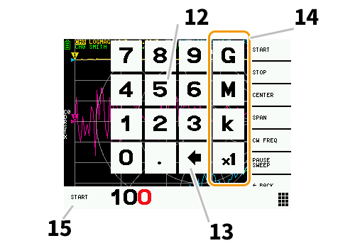

### 12. 数字キー

数字をタップすると 1 文字入力されます。

### 13. バックキー

1 文字削除します。1 文字も入力していないときは入力をキャンセルし、直前の状態に戻ります。

### 14. 単位キー

現在の入力に該当する単位を乗算して、ただちに入力を終了します。×1 の場合は入力した数値がそのまま設定されます。

### 15. 入力欄

入力対象の項目名と、入力した数字が表示されます。

# 測定を開始する

## 基本的な測定シーケンス

 1. 測定する周波数範囲を設定する
 2. 較正を行う
 3. DUT を接続する

# 較正方法

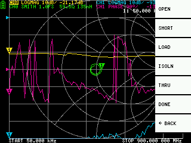

較正は基本的に、測定する周波数範囲を変更する度に実行する必要があります。正しくエラー修正がされている場合、画面上の較正状態表示は `Cn D R S T X` となります。n はロードしているデータ番号です。

ただし NanoVNA は既存の較正情報を補完してある程度正しい表示を行うことができます。較正データをロードした後に周波数範囲を変更した場合、この状態になります。このとき、画面上の較正状態の表示は `cn D R S T X` となります。n はロードしているデータ番号です。

 1. 現在の較正状態をリセットします `CAL` `RESET` 
 2. CH0 ポートに OPEN スタンダードを接続し、`CAL` `CALIBRATE` `OPEN` を実行します。
 3. CH0 ポートに SHORT スタンダードを接続し、`CAL` `CALIBRATE` `SHORT` を実行します。
 4. CH0 ポートに LOAD スタンダードを接続し、`CAL` `CALIBRATE` `LOAD` を実行します。
 5. CH0, CH1 ポートに LOAD スタンダードを接続し、`CAL` `CALIBRATE` `ISOLN` を実行します。ロードが 1 つしかない場合 CH0 ポートは未接続でもかまいません。
 6. CH0, CH1 ポートにケーブルを接続し、ケーブル同士をスルーコネクタで接続して、`CAL` `CALIBRATE` `THRU` を実行します。
 7. 較正を終了し、誤差の補正情報を計算します `CAL` `CALIBRATE` `DONE`
 8. データ番号を指定して保存します。`CAL` `CALIBRATE` `SAVE` `SAVE 0`

※
各較正データの取り込みは、十分に表示が安定してから行う必要があります。

# 機能

## トレース表示

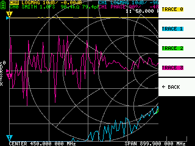

トレースは最大 4 つ表示でき、そのうちの 1 つがアクティブなトレースとなります。

トレースは必要なものだけを表示させることができます。表示を切り替えるには `DISPLAY` `TRACE` `TRACE n` を選択します。

アクティブなトレースを切り替えるには以下の方法があります。

 * アクティブにしたいトレースのマーカーをタップする
 * `DISPLAY` `TRACE` `TRACE n` を選択して表示させる。(既に表示されている場合、一時非表示にする必要があります)

### トレースフォーマット

各トレースはそれぞれにフォーマットを指定できます。アクティブなトレースのフォーマットを変更するには
`DISPLAY` `FORMAT` 変更したいフォーマットを選択します。

各フォーマットの表示は以下の通りです。

 * `LOGMAG`: 測定値の絶対値の対数
 * `PHASE`: -180°から+180°の範囲での位相
 * `DELAY`: 遅延
 * `SMITH`: スミスチャート
 * `SWR`: Standing Wave Ratio
 * `POLAR`: 極座標形式
 * `LINEAR`: 測定値の絶対値
 * `REAL`: 測定値の実数
 * `IMAG`: 測定値の虚数
 * `RESISTANCE`: 測定値のインピーダンスのうち、レジスタンス成分
 * `REACTANCE`: 測定値のインピーダンスのうち、リアクタンス成分

### トレースのチャンネル

NanoVNA には `CH0` `CH1` の 2 つのポートがあります。それぞれのポートで以下の S パラメータが測定できます。

 * `CH0` S11 (反射損失)
 * `CH1` S21 (挿入損失)

 トレースのチャンネルを変更するには `DISPLAY` `CHANNEL` の `CH0 REFLECT` または `CH1 THROUGH` を選択します。

## マーカー

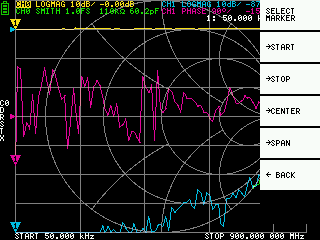
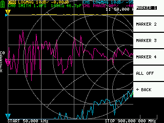

マーカーは最大 4 つまで表示できます。マーカーの表示は `MARKER` `SELECT MARKER` `MARKER n` から行います。マーカーを表示すると、アクティブなマーカーは表示したマーカーに設定されます。

## 時間ドメインオペレーション

NanoVNA は周波数ドメインデータを信号処理することにより、時間ドメイン測定をシミュレーションできます。

測定データを時間ドメインに変換する場合 `DISPLAY` `TRANSOFRM` `TRANSFORM ON` を選択します。`TRANSFORM ON` が有効な場合、測定データは直ちに時間ドメインに変換されて表示されます。

時間ドメインと周波数ドメインには以下の関係があります。

 * 最大周波数を上げるほど時間分解能が上がる
 * 測定周波数の間隔が狭いほど (すなわち最大周波数が低いほど) 最大時間長が伸びる

このことから最大時間長と時間分解能はトレードオフの関係にあります。

時間長を距離と言いかえると、以下のことが云えます。

 * 最大測定距離を長くしたいなら、最大周波数を下げる必要がある
 * 精度よく距離を特定したいなら、最大周波数を上げる必要がある。

### 時間ドメイン バンドパス

バンドパスモードでは、インパルス信号に対する DUT の応答をシミュレートできます。

トレースフォーマットは `LINEAR` `LOGMAG` `SWR` に設定できます。

以下にバンドパスフィルタのインパルス応答の例を示します。

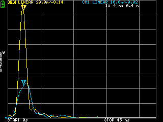

### 時間ドメインローパス インパルス

ローパスモードでは、TDR をシミュレートできます。ローパスモードでは、スタート周波数は 50kHz、ストップ周波数は計測したい距離に応じて設定する必要があります。

トレースフォーマットを `REAL` に設定できます。

以下にオープン状態のステップ応答と、ショート状態のインパルス応答の例を示します。

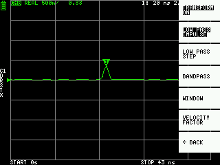


### 時間ドメインローパス ステップ

ローパスモードでは、TDR をシミュレートできます。ローパスモードでは、スタート周波数は 50kHz、ストップ周波数は計測したい距離に応じて設定する必要があります。

トレースフォーマットを `REAL` に設定できます。

以下にオープン状態のステップ応答と、ショート状態のステップ応答の例を示します。

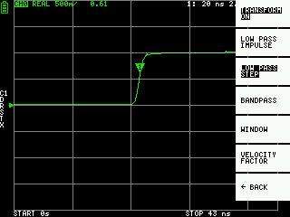
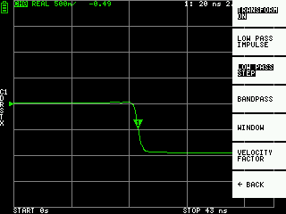

### 時間ドメイン ウィンドウ

測定できる範囲は有限個数であり、最低周波数及び最大周波数が存在します。ウィンドウはこの不連続な測定データを滑らかにし、リンギングを抑えるめに使用できます。

ウィンドウには 3 段階あります。

 * MINIMUM (ウィンドウなし、すなわち矩形窓と同じです)
 * NORMAL (カイザー窓のβ=6 に相当します)
 * MAXIMUM (カイザー窓のβ=13 に相当します)

MINIMUM では最大限分解能が高くなります、MAXIMUM では最大限ダイナミックレンジが高くなります。NORMAL はその中間です。

### 時間ドメインでの波長短縮率 (Velocity Factor) の設定

ケーブル中の電磁波の伝送速度はその材質によって変化します。真空中の電磁波の伝送速度に対する比を波長短縮率 (Velocity Factor, Velocity of propagation) と呼びます。これはケーブルの仕様に必ず記載されています。

時間ドメインでは、表示される時間を距離に換算した表示をできます。
距離表示の際使用される波長短縮率は `DISPLAY` `TRANSFORM` `VELOCITY FACTOR` で設定できます。例えば、67％ の波長短縮率を持つケーブルの TDR を測定した場合は、`VELOCITY FACTOR` で `67` を指定します。

### マーカーから周波数を設定

以下のように、マーカーから周波数範囲を設定できます。

 * `MARKER` `→START` アクティブマーカーの周波数をスタート周波数に設定します
 * `MARKER` `→STOP` アクティブマーカーの周波数をストップ周波数に設定します
 * `MARKER` `→CENTER` アクティブマーカーの周波数をセンター周波数に設定します。スパンは現在の範囲をできるだけ維持するように調整されます。
 * `MARKER` `→SPAN` アクティブマーカーを含む、表示されている 2 つのマーカーをスパンに設定します。マーカーが 1 つだけ表示されている場合は何も起きません。

## 測定範囲の設定

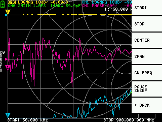

測定範囲の設定には 3 つの種類があります。

 * スタート周波数・ストップ周波数を設定する
 * センター周波数・スパンを設定する
 * ゼロスパン

### スタート周波数・ストップ周波数を設定する

それぞれ、`STIMULUS` `START`、`STIMULUS` `STOP` を選択して設定します。

### センター周波数・スパンを設定する

それぞれ、`STIMULUS` `CENTER`、`STIMULUS` `SPAN` を選択して設定します。

### ゼロスパン

ゼロスパンは周波数スイープを行わず、1 つの周波数を連続で送出するモードです。

`STIMULUS` `CW FREQ` を選択して設定します。

### 一時的に測定を停止する

`STIMULUS` `PAUSE SWEEP` を選択すると、一時的に測定を停止します。


## 較正と設定の呼び出し


較正データは最大 5 つ保存可能です。NanoVNA は起動直後、番号 0 のデータをロードします。

較正データとは、以下の情報を含むデータです。

 * 周波数の設定範囲
 * 各測定点における誤差補正
 * トレースの設定状態
 * マーカーの設定状態
 * ドメインモードの設定
 * 波長短縮率の設定
 * electrical delay

`CAL` `SAVE` `SAVE n` を選択することで、現在の設定を保存できます。

`CAL` `RESET` を選択することで、現在の較正データをリセットできます。較正を再度行う場合は `RESET` を行う必要があります。

`CAL` `CORRECTION` は現在エラー修正が行われているかを示します。これを選択して一時的にエラー修正を止めることができます。

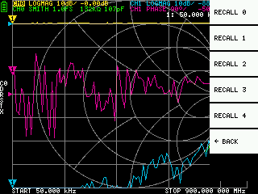

`RECALL` `RECALL n` を選択することで、保存した設定を呼びだすことができます。

## 機器の設定

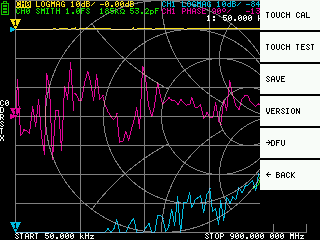

`CONFIG` 以下では機器の全般的な設定などを行うことができます。

### タッチパネルの較正とテスト


`CONFIG` `TOUCH CAL` を選択すると、タッチパネルの較正を行うことができます。実際のタップ位置と、認識されるタップ位置に大きな差がある場合には、これを実行することで解決できます。`TOUCH CAL` を行ったあと、`TOUCH TEST` を行って正しく設定されていることを確認し、`SAVE` で設定を保存します。

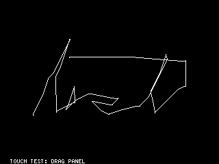

`CONFIG` `TOUCH TEST` を選択すると、タッチパネルのテストを行うことができます。タッチパネルをタップしている間は線がひかれます。タッチパネルから離すと元の状態に戻ります。

### 機器の設定の保存

`CONFIG` `SAVE` を選択すると機器の全般的な設定を保存できます。機器の全般的な設定とは、以下の情報を含むデータです。

 * タッチパネルの較正情報
 * グリッドカラー
 * トレースカラー
 * デフォルトでロードされる較正データ番号

 タッチパネルの較正情報以外は、現在設定する方法がありません。

### バージョンを表示する


`CONFIG` `VERSION` を選択すると、機器のバージョン情報を表示できます。

### ファームウェアアップデート

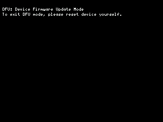

`CONFIG` `→DFU` `RESET AND ENTER DFU` を選択すると、機器をリセットし、DFU (Device Firmware Update) モードに入ります。このモードでは USB 経由でファームウェアアップデートが可能です。

# ファームウェアの更新方法

## ファームウェアの入手方法

### ttrftech 版ファームウェア

オリジナルのファームウェアです。バージョン管理されており、頻繁に開発されています。

 * [GitHub releases](https://github.com/ttrftech/NanoVNA/releases)
 * [CircleCI build](https://cho45.stfuawsc.com/NanoVNA/dfu.html)

 GitHub releases にはある程度安定したリリース版のファームウェアがあります。

 CircleCI にはコミットごと全てのファームウェアがあります。最新の機能を試したい場合や、不具合を確認する場合はこちらを使用します。

### hugen79 版ファームウェア

 * [Google Drive](https://drive.google.com/drive/folders/1IRz6E1wlkRyV0u7sbqj0lhWST-GV1szY)
 
Google Drive に最新のファームウェアが配置されています。

### 自分でビルドする

github のリポジトリを clone して自分でビルドすることも簡単にできます。


## ファームウェアの書きこみかた

書きこみかたはいろいろな方法がありますが、ここでは [dfu-util](http://dfu-util.sourceforge.net/) を用いて説明します。
dfu-util はクロスプラットフォームツールであり、Windows ではバイナリも提供されていますので、ダウンロードするだけで使用できます。

### dfu-util を使った書きこみ (Ubuntu)

標準パッケージリポジトリに dfu-util があります。

```
sudo apt-get install dfu-util
dfu-util --version
```

デバイスを DFU モードで起動します。以下のいずれかの方法で DFU モードになります。

 * PCB 上の BOOT0 ピンをジャンパーしながら電源を入れる。(電源を入れたあとはジャンパーを外します) 画面が真っ白になりますが正常です。
 * `CONFIG` `→DFU` `RESET AND ENTER DFU` を選択する


以下のコマンドを実行します。build/ch.bin はダウンロードしたファームウェアファイルの .bin までのパスを記述します。

```
dfu-util -d 0483:df11 -a 0 -s 0x08000000:leave -D build/ch.bin
```

### dfu-util を使った書きこみ (macOS)

[homebrew](https://brew.sh/index_ja) を使ってインストールするのがお勧めです。

brew コマンドのインストールをします。

```
ruby -e "$(curl -fsSL https://raw.githubusercontent.com/Homebrew/install/master/install)"
```

dfu-util コマンドのインストールをします。

```
brew install dfu-util
```

dfu-util コマンドが正常に起動できることを確認します。

```
dfu-util --version
```

デバイスを DFU モードで起動します。以下のいずれかの方法で DFU モードになります。

 * PCB 上の BOOT0 ピンをジャンパーしながら電源を入れる。(電源を入れたあとはジャンパーを外します) 画面が真っ白になりますが正常です。
 * `CONFIG` `→DFU` `RESET AND ENTER DFU` を選択する


以下のコマンドを実行します。build/ch.bin はダウンロードしたファームウェアファイルの .bin までのパスを記述します。

```
dfu-util -d 0483:df11 -a 0 -s 0x08000000:leave -D build/ch.bin
```


### dfu-util を使った書きこみ (Windows 10)

Windows の場合、DFU モードの NanoVNA を接続すると自動的にデバイスドライバのインストールが行われますが、このデバイスドライバでは dfu-util を利用できません。
ここでは [Zadig](https://zadig.akeo.ie) を利用してドライバを入れかえます。

デバイスを DFU モードで起動します。以下のいずれかの方法で DFU モードになります。

 * PCB 上の BOOT0 ピンをジャンパーしながら電源を入れる。(電源を入れたあとはジャンパーを外します) 画面が真っ白になりますが正常です。
 * `CONFIG` `→DFU` `RESET AND ENTER DFU` を選択する

DFU モードにした NanoVNA を接続した状態で Zadig を起動し、以下のように STM32 BOOTLOADER に対して WinUSB をドライバとして利用するようにします。

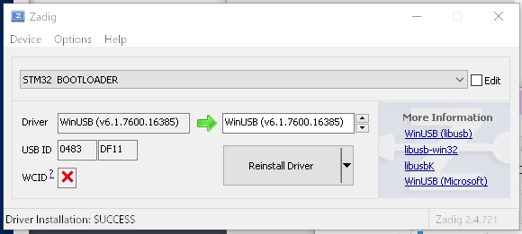

次に dfu-util を配置します。releases から [dfu-util-0.9-win64.zip](http://dfu-util.sourceforge.net/releases/dfu-util-0.9-win64.zip) をダウンロードして展開します。
ここでは例として C:\dfu-util に展開したものとします (どこでもかまいません)。

スタートメニューを右クリックして Windows PowerShell を選択します。シェルの画面が開きます。

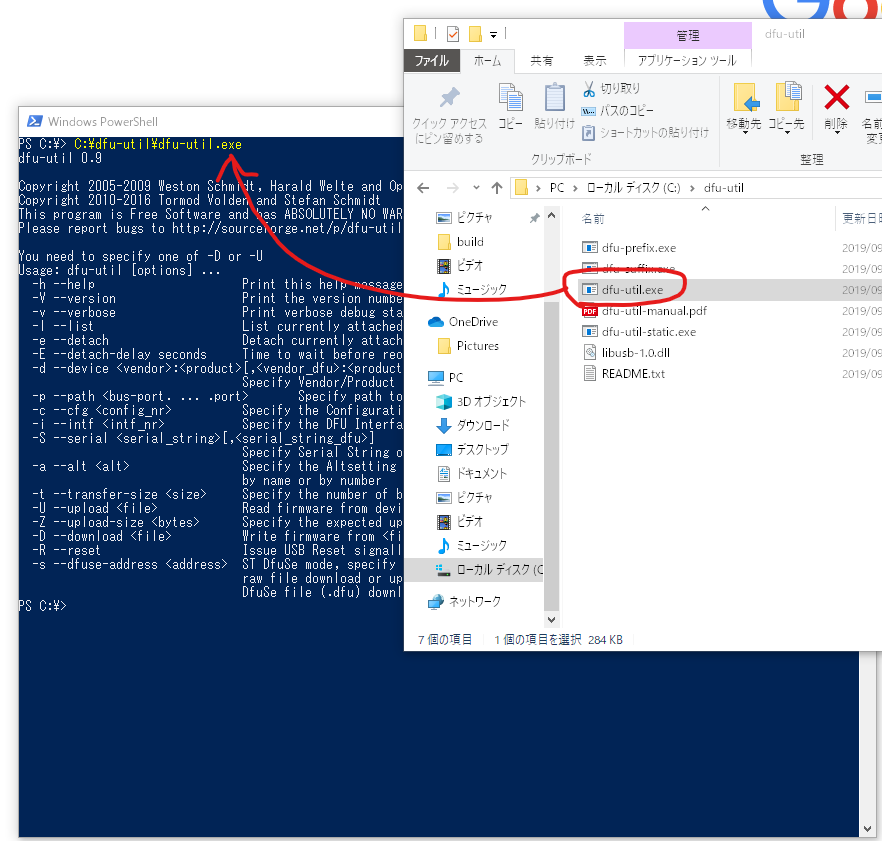

エクスプローラから dfu-util.exe を PowerShell へドラッグ・アンド・ドロップするとパスが自動挿入されます。以下のように `--version` をつけて起動すると dfu-util のバージョン表示ができます。

```
C:\dfu-util\dfu-util.exe --version
```

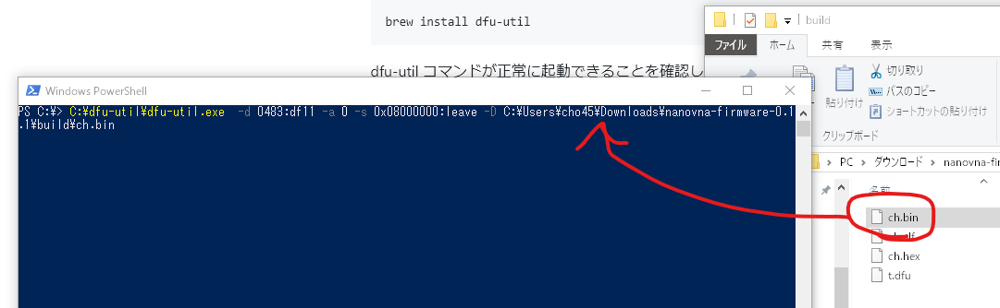

同様にファームウェアのファイルもエクスプローラから PowerShell へドラッグ・アンド・ドロップすることでパスが入力できます。


以下のコマンドを実行します。build/ch.bin はダウンロードしたファームウェアファイルの .bin までのパスを記述します。

```
C:\dfu-util\dfu-util.exe -d 0483:df11 -a 0 -s 0x08000000:leave -D build\ch.bin
```

## ファームウェアの書きこみかた (Windows GUI)

CUI になじみのないかた向けに、若干面倒な手順が必要ですが ST が提供する DfuSE Demo ツールを使った書きこみ方法も参考程度に紹介します。

[ST のサイトから STSW-STM32080](https://www.st.com/ja/development-tools/stsw-stm32080.html) をダウンロードします。

 * DFU File Manager: .bin または .hex から .dfu ファイルを作成するツール
 * DfuSe Demo: .dfu ファイルをデバイスに書きこむツール

が含まれています。

### DFU File Manager でファイル形式を変換する。

まず DFU File Manager を起動します。

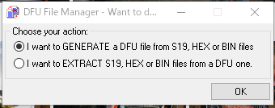

`I want to GENERATE a DFU file from S19, HEX or BIN files` を選択します。

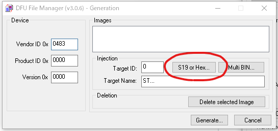

`S19 or Hex...` ボタンをクリックします。`ch.hex` などファームウェアの .hex ファイルを選択します。

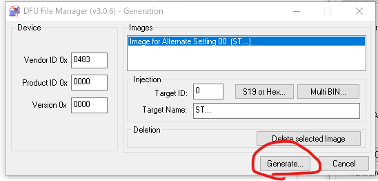

`Generate...` ボタンをクリックして、適当な名前をつけて .dfu ファイルを作成します。

### DfuSe Demo でファームウェアを書きこみ

まずデバイスを DFU モードで起動します。以下のいずれかの方法で DFU モードになります。

 * PCB 上の BOOT0 ピンをジャンパーしながら電源を入れる。(電源を入れたあとはジャンパーを外します) 画面が真っ白になりますが正常です。
 * `CONFIG` `→DFU` `RESET AND ENTER DFU` を選択する

DfuSe Demo を起動します。Available DFU Devices に `STM Device in DFU Mode` があることを確認して、`Choose...` をクリックします。

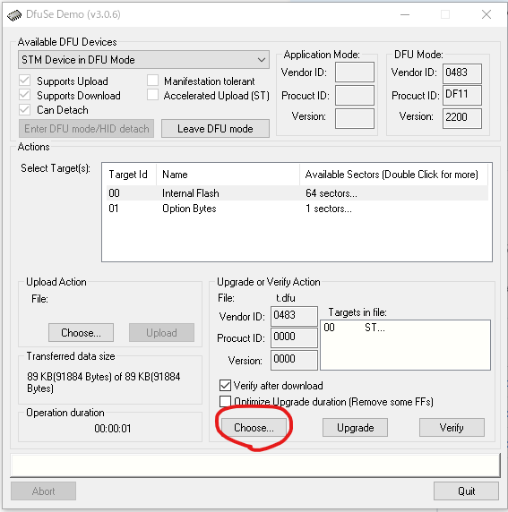

先程保存した .dfu ファイルを選択します。

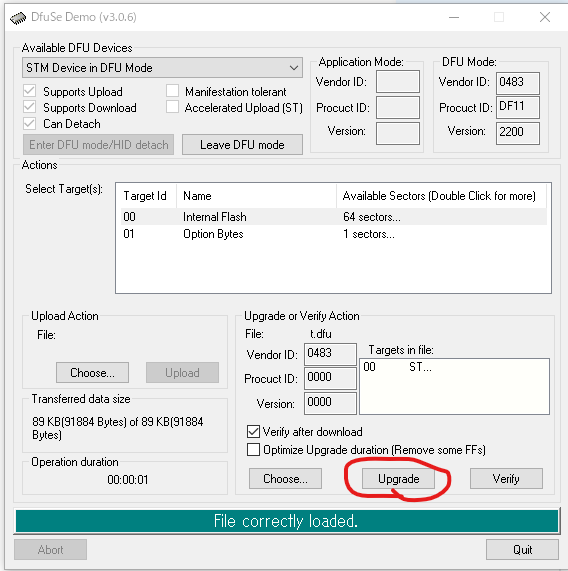

`Upgrade` ボタンをクリックします。

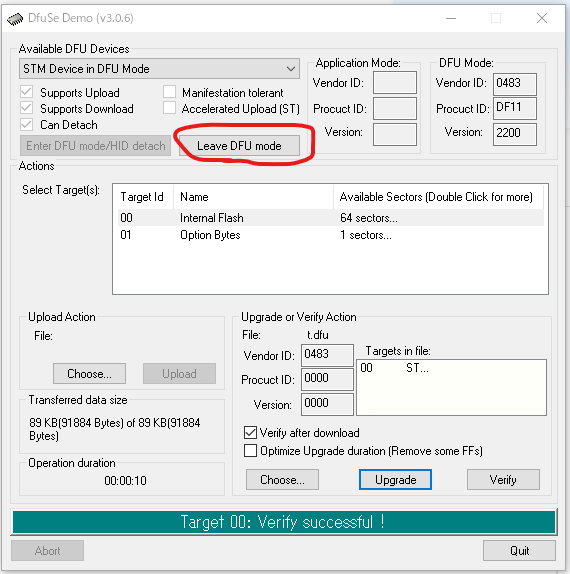

書きこみが終わるとこの画面になるので、`Leave DFU mode` ボタンをクリックして DFU モードを抜けます。デバイスがリセットされて新しいファームウェアで起動します。

# ファームウェア開発の手引き

NanoVNA のファームウェアの開発の必要なものは以下の通りです。

 * Git
 * gcc-arm-none-eabi
 * make

これらが既にある環境なら、`make` でファームウェアのビルドが可能です。

```
git clone git@github.com:ttrftech/NanoVNA.git
cd NanoVNA
git submodule update --init --recursive
make
```

## Docker を使ったビルド

docker を使うとわずらわしいことなしにビルドできます。docker は無償で利用できるクロスプラットフォームのコンテナユーティリティです。特定の環境 (今回の場合、ビルド環境) を素早く再現するために利用できます。

[docker](https://hub.docker.com/) をインストールした上で、以下のコマンドを実行するだけです。

```
docker run -it --rm -v $(PWD):/work edy555/arm-embedded:8.2 make
```

## Visual Studio Code を使ったオンチップデバッグ

Visual Studio Code (以下 VSCode) は Microsoft が無償で提供するマルチプラットフォームなコードエディタです。
[Cortex-Debug](https://marcelball.ca/projects/cortex-debug/) Extension を導入することでオンチップデバッグを GUI で行うことができます。

プラットフォーム依存の部分は省きますが、上記に加えて以下のものが必要です。

 * openocd
 * VSCode
 * Cortex-Debug

Cortex-Debug は VSCode の Extensions から検索して Install します。

### tasks.json

まず VSCode 上で NanoVNA 全体を make するする「タスク」を定義します。

```
{
    "tasks": [
        {
            "type": "shell",
            "label": "build",
            "command": "make",
            "args": [
            ],
            "options": {
                "cwd": "${workspaceRoot}"
            }
        }
    ],
    "version": "2.0.0"
}
```

これで VSCode 上のタスクとして make できるようになります。

### launch.json

次に Debug 時にどのように起動するかを定義します。Cortex-Debug の説明に従って設定します。

以下は ST-Link を使った場合の設定です。もし J-Link を使う場合は `interface/stlink.cfg` を `interface/jlink.cfg` に置き換えます。

```
{
    "version": "0.2.0",
    "configurations": [
        {
            "type": "cortex-debug",
            "servertype": "openocd",
            "request": "launch",
            "name": "OpenOCD-Debug",
            "executable": "build/ch.elf",
            "configFiles": [
                "interface/stlink.cfg",
                "target/stm32f0x.cfg"
            ],
            "svdFile": "./STM32F0x8.svd",
            "cwd": "${workspaceRoot}",
            "preLaunchTask": "build",
        }
    ]
}
```

`svdFile` に指定するファイルは [ST のサイト](https://www.st.com/ja/microcontrollers-microprocessors/stm32f072c8.html#) からダウンロードできます。
`svdFile` は指定しなくても動作に支障はありません。

### デバッグを開始する

Start Debugging (`F5`) をすると、make によるビルドののち、OpenOCD が自動的に起動してファームウェアの転送が行われます。
転送が終わるとリセットハンドラでブレークした状態になります。

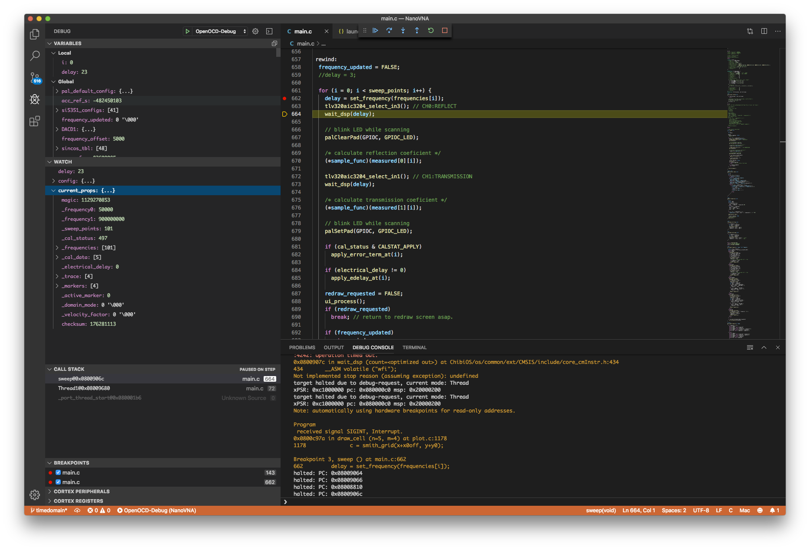

`svdFile` を指定している場合、定義済みの MCU のレジスタがデバッグ画面に表示されます。

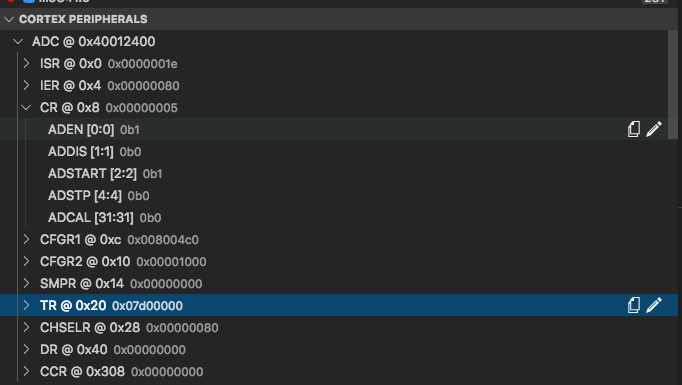

# 使用例

## バンドパスフィルタの調整
TODO

## アンテナの調整

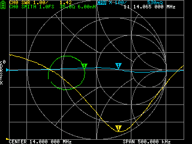

NanoVNA をアンテナアナライザーとして利用する例を示します。

アンテナの調整において重要なのは以下の 2 点です。

 * アンテナが同調・共振状態にあるか (すなわちリアクタンスが目的とする周波数で 0 に近いか)
 * アンテナの SWR が低いか (十分にマッチングがとれているか)

### トレースの設定

アンテナの調整では CH0 のみを使用しますので、`THRU` と `ISOLN` 以外の全ての項目について、較正を実施します。

トレース設定は以下のようにします。

 * トレース 0: CH0 SWR
 * トレース 1: CH0 REACTANCE
 * トレース 2: CH0 SMITH
 * トレース 3: OFF

アンテナの同調させたい周波数を `CENTER` に設定し、`SPAN` を適切に設定します。

リアクタンスを表示しているトレース 1 が 0 に近い周波数を探します。その周波数が同調点ですので、ずれていればアンテナを調整し、目的の周波数に同調点がくるようにします。

同調点が目的の周波数にあったら、SWR を表示しているトレース 0 が十分に低い (1 に近い) SWR を表示しているかを確認します。もし十分に (2 以下の) SWR を示していない場合、スミスチャートを使ってマッチングを行います。
この際、マッチングはアンテナ直下のアンテナチューナーなどを使ってもかまいません。

SWR が落ちれば、目的の周波数で同調し、SWR が低いアンテナの調整は終わりです。

## ケーブルの確認

時間ドメインのローパスモードを使うことで TDR をシミュレートできます。TDR を使うことで、伝送路の不具合を発見できます。

TODO

## コモンモードフィルタの測定

TODO
